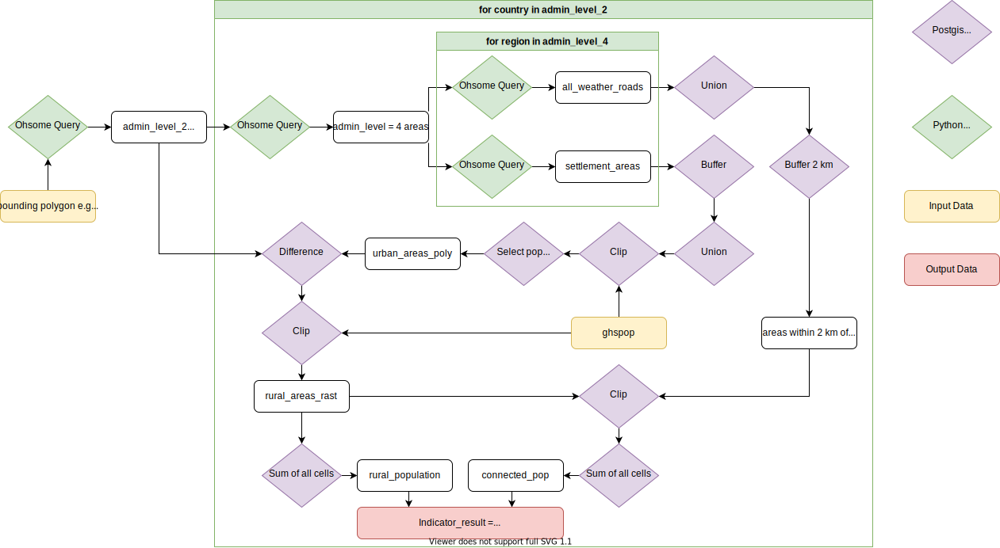

IdeaCollection: https://docs.google.com/document/d/1bEDqMQ4cxWHQNkPbpj8nWvn5n961WpiUB7C6APsGVKg/edit?usp=sharing

PPT: https://docs.google.com/presentation/d/1px8OLGjm3PTz_cdLTb3ld5GFNMwpQwFxYKOkbK3hGwM/edit?usp=sharing

In this project we analyze the infrastructure of Australia following the 9.1.1 SDG Indicator.

result for australia: [(3869995.74741819, 1528064.42418031)] -> 39,48% reachable with all weather roads -> O.o

  

